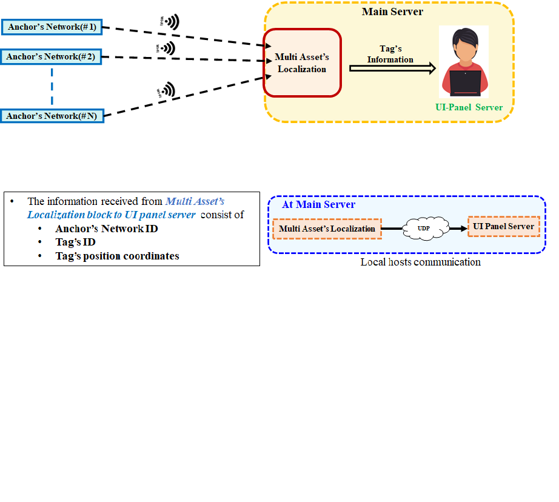

# UWB Real-Time-Localization-System UI
- This repository contains the project details of UWB RTLS UI performance.
- UWB RTLS UI stands for Ultra Wide Band Real time localization system User Interface. 
- This UI has implement on .NET Framework platform using C# Winform application. 

### What is Real-time localization system (RTLS)?
Real time localization system (RTLS) is a technology solution that automatically identify and track the location of objects or people in real time, in most cases with in a building such as ware house, shipping yard, hospital, or campus. 
#### RTLS consisting of three main components: 
- Mobile Tags
- Fixed Anchors 
- Control PC (with User interface) at the end. 

### What is RTLS UI?
RTLS–UI is the end component of the RTLS system. It’s a visual application which gives the system distinctive “look” and “feel” for the user to manipulates the information in 2D or 3D graphics display. The information processed by the User Interface is mainly based on the object’s position coordinates received from the localization algorithm. 

### Why it's called as UWB RTLS UI?
Because this whole RTLS systems employed UWB (ultra wide band) sensors system for gathering the location information of moving objects or humans to visualize and analyze on user interface panel. Figure1 shows the main setup for UWB RTLS.  

### Purpose of developing UI:
The purpose of developing this UI is to track and visualize the activites and movements of dementia patients in nursing home.
The information received by UI through UWB sensor Network deployed at nursing home
The Tags will be worn by patients of nursing home (Tag can be form or locket or watch)

## Tags Visualization and Zone Tracking 
For Tags visualization the RTLS setup comprises of two main blocks: 1. Anchor Network, and 2. Main Sever Block. The Anchor Network deployed in the nursing home. However, Main Server Block consisting of Client and UI panel Server.  Basically Client represents the Anchor’s Network and generally this room served as Client for UI panel. The client consisting of the program which receives information of tags from the anchor’s network then after processing the information it then sends to UI panel server. The information sends by client to UI panel consisting of Tag’s ID and its position coordinates (x and y). In case of multiple Tags, the client sequentially sends each tag information to UI Panel server.  

For the zone tracking scenario, two zones have assigned at one side of the any room and labeled as Zone1 and Zone2 of area 3m x 3m. The tracking data in each zone is logged in a text file which is later process in data analysis. 

# UWB RTLS UI setup
 
